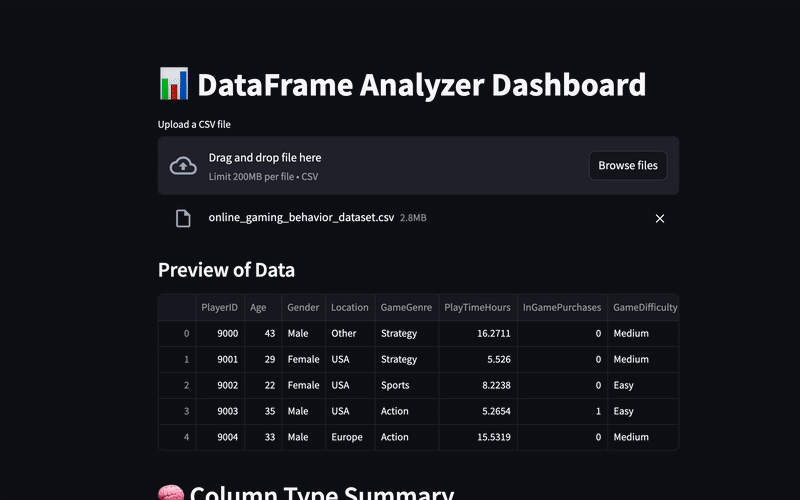

# 👀 peeky-data

**peeky-data** is a lightweight Streamlit dashboard for quickly exploring and summarizing CSV files. Upload your dataset and get instant insights — no code required.

## 🚀 Features

- 🔍 **Column type detection** — String, int, float, and numeric-like strings
- 📉 **Missing values summary** — NaN counts for every column
- 🧮 **Numeric stats** — Min, max, mean, and standard deviation
- 🏷️ **Categorical summary** — Unique values and top 5 frequent values with percentages
- 🔢 **Smart binning for integer columns** — Automatically bins high-cardinality integer columns into 10 bins and summarizes them

## 🎬 Demo




## 🌐 Try it online

👉 [peeky-data.streamlit.app](https://peeky-data.streamlit.app/)

No setup needed — just upload your CSV and explore.

## 💻 Run locally

```bash
git clone https://github.com/your-username/peeky-data
cd peeky-data
pip install -r requirements.txt
streamlit run app.py
